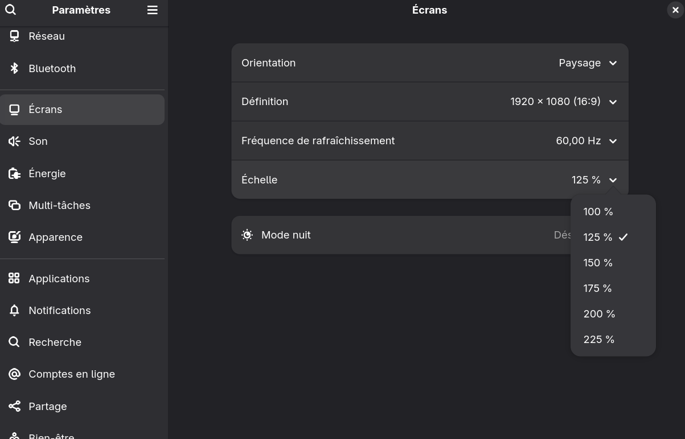

<h1>Bienvenue dans ma configuration NixOs</h1>

## Contexte

<h3>Introduction à Nix et à NixOs</h3>

Pour ceux qui ne connaissent pas, NixOs est une distribution linux pas comme les autres.
En effet, contrairement à la plupart des distributions linux, il ne respecte pas [la norme de la hiérarchie des systèmes de fichiers (FHS)](https://fr.wikipedia.org/wiki/Filesystem_Hierarchy_Standard).
En effet, il est basé sur le [gestionnaire de packets Nix](https://fr.wikipedia.org/wiki/Nix_(gestionnaire_de_paquets)), qui promet la reproductibilité, la robustesse, la portabilité et la stabilité. 
On a l'habitude de le présenter comme un système qu'on peut coder. C'est-à-dire que sa configuration est déclarative.
Pour en savoir plus, je vous invite à vous renseigner sur [NixOs](https://fr.wikipedia.org/wiki/NixOS) à travers wikipedia, des vidéos ou autre.

<h3>Nix/NixOs : difficile et chronophage ?</h3>

J'ai découvert NixOs grâce à un bon ami. J'ai donc voulu l'essayer, et j'ai fini par l'adopter !
Ma crainte était qu'il faille passer par des étapes compliquées et/ou très chronophages pour installer le moindre packet ou pour changer de petites options.
Et en effet NixOs demande certes un temps de compréhension et requiert beaucoup de temps pour le personnaliser exactement comme on le souhaite, en passant par des paramètres avancées. Surtout si on souhaite qu'il soit un maximum reproductible, c'est-à-dire qu'on tient à tout configurer en déclaratif.

Mais en réalité ce n'est pas nécéssaire. Si on installes NixOs avec un environnement de bureau comme Gnome ou KDE, le système sera en apparence comme un autre système linux utilisant gnome ou KDE. Firefox y est préinstallé et beaucoup de paramètres sont modifiables via l'application "Paramètres". La différence se situe surtout dans la gestion des packets et dans les options du système qu'on souhaite reproductibles.

Par exemple, pour ajouter un packet il faut l'ajouter dans le fichier de configuration `/etc/nixos/configuration.nix`. Mais c'est très simple, cela ne demande que de chercher l'existence du packet et son nom exact (sur [NixOs Search](https://search.nixos.org/packages) par exemple) et d'ajouter une ligne dans un fichier pré-remplit. 
Si on souhaite modifier une option de manière déaclarative, on va devoir chercher cette option sur [MyNixOs](https://mynixos.com/) ou plus largement sur internet concernant des packets spécifiques. Sachant qu'il y a beaucoup de guides sur le [Wiki NixOs](https://wiki.nixos.org/wiki/NixOS_Wiki/fr) et le [manuel NixOs](https://nixos.org/manual/nixos/stable/).
Et si installer des applications via Nix pose problème pour x ou y raison. Il est possible [d'utiliser les flatpacks](https://nixos.wiki/wiki/Flatpak).

La difficulté se présente surtout lorsque certaines solutions que vous allez trouver sur internet ne concernent que les configurations utilisant un [home manager](https://nixos.wiki/wiki/Home_Manager) ou les [flakes](https://wiki.nixos.org/wiki/Flakes) alors que ce n'est pas votre cas ou inversement.
Même s'il est recommander d'utiliser un home-manager et les flakes pour un meilleur système, avec plus de possibilités.
###### Même si lorsque j'écris ce document les flakes sont experimentaux, ils sont fiables et beaucoup les utilisent. Ils permettent d'ailleurs une meilleur stabilité du système.


## Organisation

### État du système
Tout d'abord et pour faire court, mon système utilise gnome comme environnement de bureau et un [home manager](https://nixos.wiki/wiki/Home_Manager). Je compte utiliser les flakes à l'avenir pour débloquer de nouvelles fonctionnalités, pour garantir une meilleure staibilité de mon système et pour maîtriser davantage Nix.

### Développement
je tiens à préciser que par souci de praticité, j'utilise `vscodium` (Vscode) pour modifier ma configuration NixOs. Pour cela j'ai d'ailleurs déplacé mes fichiers de configuration Nix dans le répertoire personnel de mon compte utilisateur (`~/.config/nixos`).

Mon fichier `/etc/nixos/configuration.nix` ressemble désormais à ceci:
```nix
{ config, pkgs, ... }:
{
  imports =
    [ # Répertoire dans lequel se trouve tous mes fichiers de configuration nixos
      /home/nostres/.config/nixos
    ]; 
}
```
###### Vous l'aurez remarqué, l'importation se fait depuis un répertoire. Dans cette situation, cela prend en réalité le fichier `default.nix` présent dans ce répertoire. 

Et j'ai du rediriger la configuration de mon utilisateur (nostres) vers `~/.config/nixos/home-nostres` à l'aide de cette ligne dans `home-manager.nix`:
```nix
{
  home-manager.users.nostres = import ./home-nostres;
}
```


Trouvant la configuration NixOs archaïque, non pas que m'aider d'internet me dérange mais que ça manque peut-être un peu d'autocomplétion et de correction syntaxique, j'ai cherché à simplifier la configuration en Nix avec des outils supplémentaires.
J'ai donc :
1. installé l'extension Vscode Nix IDE
2. ajouté le formateur nix [`nixfmt-rfc-style`](https://github.com/NixOS/nixfmt) dans les packets à installer
3. pareil pour le serveur de langage Nix [`nixd`](https://github.com/nix-community/nixd) (mais il y a aussi `nil`)
4. configuré le fichier settings.json de l'extension Nix IDE comme ceci:
```json
{
  "nix.serverPath": "nixd",
  "nix.enableLanguageServer": true,
  "nixpkgs": {
    "expr": "import <nixpkgs> { }"
  },
  "formatting": {
    "command": [
      "nixfmt"
    ]
  },
  "nix.formatterPath": "nixfmt"
}
```

Et ça me fait de l'auto-complétion et du formattage de code automatique pour Nix ! (ps: c'est pas fini)

## Problématiques rencontrées
Pour "Déplacer le fichier .home.nix avec un home manager", "Coder sa configuration nix avec vscode (ou vscodium)", "Coder avec plusieurs fichiers Nix / importer des fichiers Nix" ou "Simplifier le code Nix / utiliser un formatteur Nix / utiliser un LSP Nix", la solution se trouve dans la partie [Développement](#développement) juste au dessus

Pour les problèmes et astuces autour des ordinateurs portables, il y a [une page dédiée aux ordinateurs portables](https://nixos.wiki/wiki/Laptop) sur le wiki de NixOs.

### Laptop: Arrêt du chargement de la batterie à 80% pour préserver sa durée de vie
Solution trouvée : 
```nix
{
  services.power-profiles-daemon.enable = false; #Désactivé pour éviter les conflits avec tlp
  services.tlp = {
      enable = true;
      settings = {

        START_CHARGE_THRESH_BAT0 = 40; # à 40% et en dessous, il commencer le chargement
        STOP_CHARGE_THRESH_BAT0 = 80; # à 80% et au desssus il arrête le chargement

      };
  };
}
```
Seulement mon ordinateur portable (Unowhy Y13) n'est pas compatible en vu de ses pilotes de gestion de la batterie :/

### Définir des extensions firefox (bientôt)
### Définir un moteur de recherche par défaut (ex: Ecosia) (bientôt)
### Définir des variables utilisables dans d'autres fichiers Nix.
J'ai cherché à définir des variables dans un fichier pour les utiliser dans d'autres fichiers pour des raisons de confidentialité.
En effet, j'ai besoin de certaines données personnelles dans ma configuration mais je ne souhaite pas qu'elles soient présentes sur ce GitHub affichant publiquement ma configuration Nix.

La solution que j'ai trouvée est d'ajouter un fichier `personal-data-vars.nix` qui contient ceci:
```nix
{ lib, ... }:
{
  options = {
    variables = lib.mkOption {
      type = lib.types.attrs;
      default = { };
    };
  };

  # Initialisation des variables
  # Format: config.variables.<nom> = valeur;
  # Ex:
  config.variables.username = "nostres";
  config.variables.email = "maconfig@nixos.com";
}
```

Les variables définies sont ensuites utilisables dans d'autres fichier à condition que le fichier `personal-data-vars.nix` soit importé au préalable.

Par exemple dans `packages.nix`:
```nix
{ pkgs, config, ... }:
{
  imports = [
    ./personal-data-vars.nix
  ];

  programs.git = {
    enable = true;
    userName = config.variables.username;
    userEmail = config.variables.email;
  };
}
```

Et pour ne pas publier `personal-data-vars.nix` publiquement, j'ai crée un fichier `.gitignore` dans lequel j'ai ajouté une ligne `personal-data-vars.nix` 

### Régler des freeze récurrents lors de la saturation de la mémoire vive (RAM)
La solution a été d'ajouter [un swap](https://fr.wikipedia.org/wiki/Espace_d%27%C3%A9change). Voici comment: 

`hardware-configuration.nix`
```nix
{
  # ...

  swapDevices = [{
    device = "/swapfile";
    size = 8 * 1024; # 8GB
  }];

  # ...
}
```

### Pouvoir définir une échelle plus précise sur Gnome
Par défaut, à l'installation de NixOs, je pouvais définir uniquement 100% ou 200% comme échelle d'affichage.
Pour pouvoir définir une échelle plus précise sur Gnome. C
omme 125%, j'ai du faire ceci:

`gnome.nix`
```nix
{ pkgs, ... }:
{
# Enable the GNOME Desktop Environment.
  services.xserver = {
  enable = true;
  displayManager.gdm = {
    enable = true;
    wayland = true;
  };
  desktopManager.gnome = {
    enable = true;
      
      # To enable fractional scaling
      extraGSettingsOverridePackages = [ pkgs.mutter ];
      extraGSettingsOverrides = ''
        [org.gnome.mutter]
        experimental-features=['scale-monitor-framebuffer']
      '';
    };
  };
}
```
Après un `sudo nixos-rebuild switch`, et un redémarrage de l'ordinateur (`reboot`), il est possible de définir une échelle d'affichage plus précise dans l'application "Paramètres", et dans la section "Écrans".



### Mises à jours automatiques
Pour mettre à jour les paquets automatiquement, il suffit d'ajouter :

`configuration.nix`
```nix
{
  # ...

  system.autoUpgrade = {
    enable = true;
    dates = "weekly"; #Voir https://mynixos.com/nixpkgs/option/system.autoUpgrade.dates pour les formats
  };

  # ...
}
```
Cela mettra à jour mes packets toutes les semaines.

### Suppression des anciennes images Nix pour libérer de l'espace
Lorsque vous faites `nixos-rebuild switch`, Nix va créer une nouvelle [image du système](https://fr.wikipedia.org/wiki/Image_syst%C3%A8me) et sauvegarder les anciennes.
Cela permet de récupérer une ancienne configuration en cas de problème mais ça prend évidemment de l'espace de stockage.

Pour supprimer les ancinnes images:
`configuration.nix`
```nix
{
  # ...

  # Voir https://mynixos.com/options/nix.gc pour plus de personnalisation
  nix.gc = {
    automatic = true;
    dates = "daily";
    options = "--delete-older-than 10d"; 
  };
  nix.settings.auto-optimise-store = true;

  # ...
}
```
Ceci va supprimer tous les jours les images sysèmes de plus de 10 jours d'ancienneté.

### Affichage des mises à jours
Par défaut, lorqu'une mise à jour d'un paquet est effecutée, les paquets mis à jours ne sont pas précisés.
Pour remédier à cela, voici la solution:

`configuration.nix`
```nix
{
  pkgs
  #, ...
}:
{
  #...

  environment.systemPackages = with pkgs; [
    # ...

    nvd
  ];

  system.activationScripts.report-changes = ''
    PATH=$PATH:${lib.makeBinPath [pkgs.nvd pkgs.nix]}
    nvd diff $(ls -d1v /nix/var/nix/profiles/system-*-link|tail -n 2)
  '';

  # ...
}
```

Ceci va configurer un script qui va préciser avec de la couleur les packets qui ont changés et précisant leur version (et l'ancienne version pour les paquets mis à jours).
(bientôt)
### Autoriser les paquets non libres (unfree) avec ou sans home manager
Simplement ajouter la ligne `nixpkgs.config.allowUnfree = true;`.
Seulement si ça a été fait dans `configuration.nix`, ça ne s'appliquera pas pour les utilisateur du home manager. Il faudra re préciser cette ligne dans les fichiers Nix de chaque utilisateur (dans `home.nix` par exemple).

### Configurer zsh avec un home manager (bientôt)

### Configurer des plugins obs avec home manager (bientôt)

### Activation et configuration de docker avec containers en déclaratif (solution inconnue)


